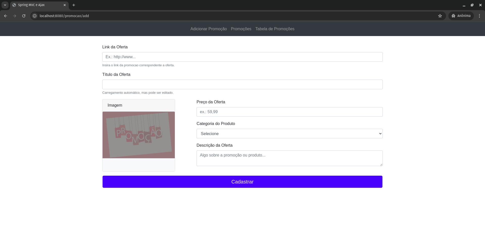
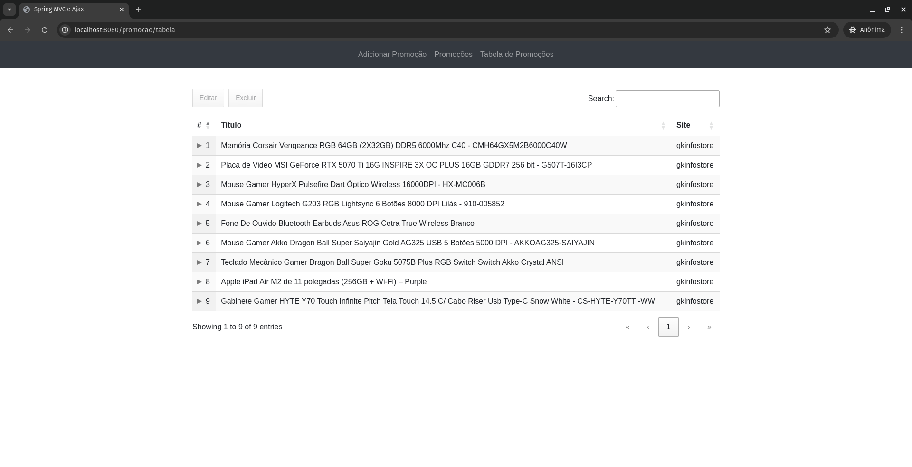

# Site de promoções

## Descrição do sistema
O sistema é uma plataforma de promoções onde os usuários podem encontrar, cadastrar e gerenciar ofertas. Ele permite adicionar promoções com links diretos, buscar ofertas disponíveis, curtir promoções e editar ou remover publicações. Além disso, conta com um sistema de notificações em tempo real, baseado em Server-Sent Events (SSE), que informa os usuários sobre novas promoções assim que são cadastradas.

## Pré-requisitos
- Docker e Docker Compose instalados.

## Instruções para Executar

1. **Clone o repositório**
   ```bash
   git clone git@github.com:rlimapro/springboot-mvc-ajax.git
   cd springboot-mvc-ajax/

2. **Inicie o sistema**
- Para construir e executar (necessário na primeira vez ou após alterações):
    ```bash
    docker-compose up --build
- Para executar sem reconstruir (se não houver mudanças):
    ```bash
    docker-compose up

3. **Acesse os serviços**
- Aplicação: http://localhost:8080
- pgAdmin: http://localhost:15432 (email: admin@admin.com, senha: admin)

## Screenshots





